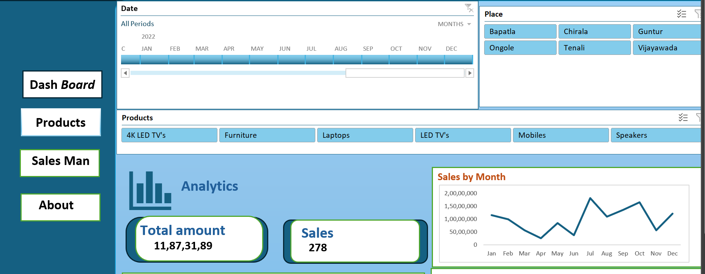

# Excel Sales Dashboard
## Dashboard Preview

## Overview

An interactive Sales Dashboard built using Microsoft Excel to analyze sales performance across products, locations, salespersons, and time periods.

## Features

* Total Sales KPI
* Total Units Sold KPI
* Product-wise Sales Analysis
* Place-wise Sales Analysis
* Monthly Sales Trends
* Interactive Slicers and Timelines

## Tools Used

* Microsoft Excel
* Pivot Tables
* Pivot Charts
* Slicers
* Dashboard Design

## Author

Anusha

